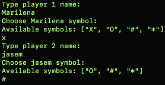
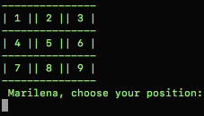
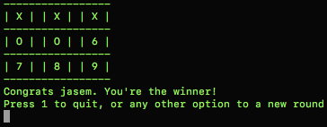
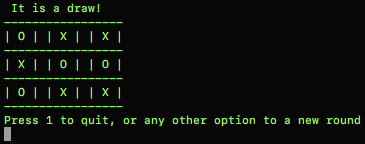

# Tic_Tac_Toe
Tic-tac-toe game developed using Ruby
​
Tic-tac-toe is a game for two players, who take turns marking the spaces in a 3×3 grid. The player who succeeds in placing three of their marks in a horizontal, vertical, or diagonal row is the winner.
If none of the player acomplish it we will have a draw.
​
## Instructions to Play on Your Local Machine
​
To have a version on you local machine:
- Clone this repository
- Open a terminal on the containing folder of this project
- Execute bin/main.rb on the project folder within your terminal
​
## Live Demo
- You can also use the Live Demo to play it online
​
[Live Demo](https://repl.it/@MarilenaRoque/MilestonesTic-tac-toe#main.rb)
​
## Instructions to Play

- Enter with the first player name
- Assign a symbol for the first player
- Repeat the steps above for the second player

- The player indicated should enter with the number where he wants to mark his symbol
- Now the next player will do the same

- The players will switch roles to mark their symbols on the table until one of those acomplish mark one whole column, row or diagonal, or until there is no more movements available. On this case we have a draw.
Collapse

## Authors

👤 **Marilena Roque**

- Github: [MarilenaRoque](https://github.com/MarilenaRoque)
- Twitter: [@MariRoq88285995](https://twitter.com/MariRoq88285995)
- Linkedin: [roquemarilena](https://www.linkedin.com/in/roquemarilena/)

👤 **Jasem Valencia**

- Github: [@githubhandle](https://github.com/JasemDuncan)
- Twitter: [@twitterhandle](https://twitter.com/JasemValencia)
- Linkedin: [@linkedin](www.linkedin.com/in/Jasem-Duncan-Valencia)

## 🤝 Contributing

    Contributions, issues and feature requests are welcome!

Feel free to check the [issues page](https://github.com/MarilenaRoque/tic_tac_toe/issues).

## Show your support

Give a ⭐️ if you like this project!

## 📝 License
This project is [MIT](lic.url) licensed.